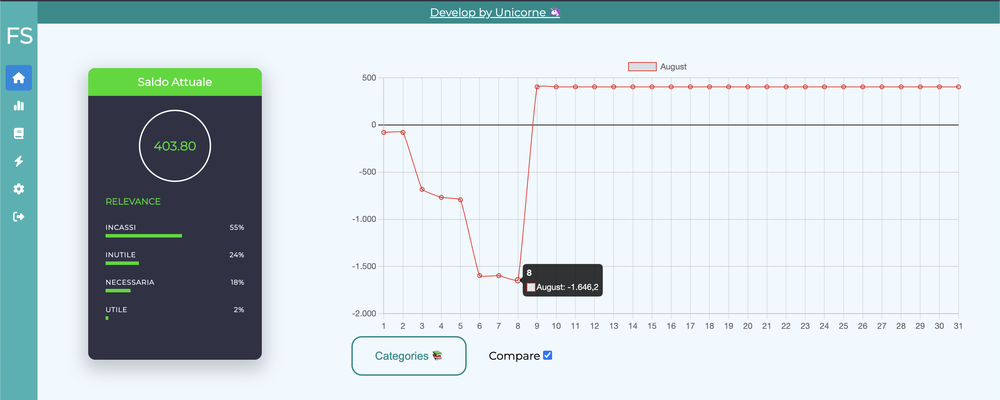
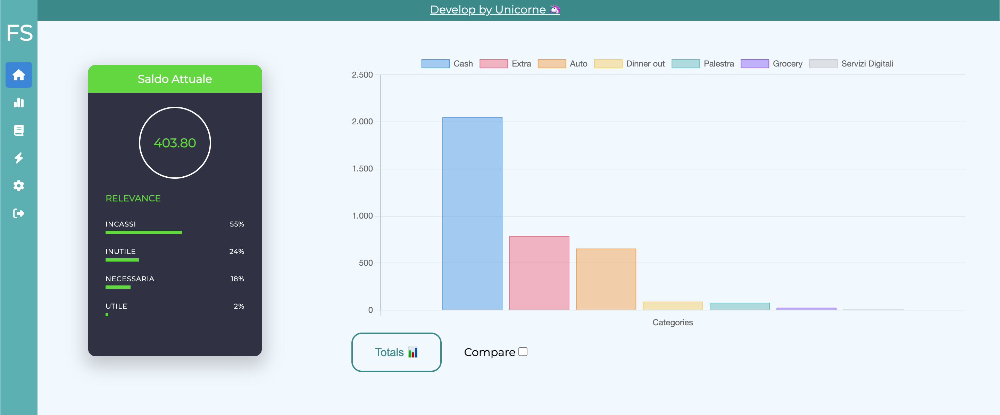
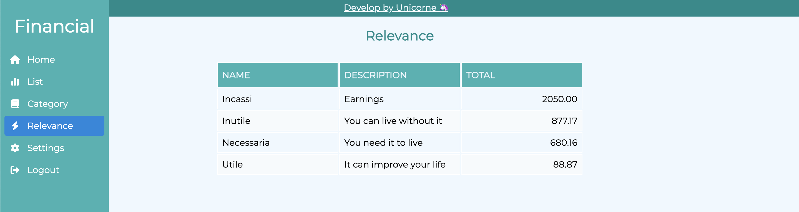
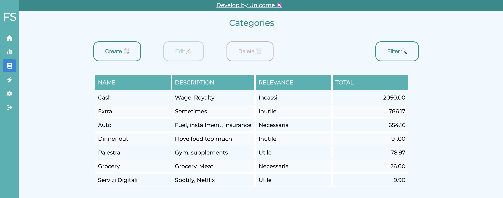
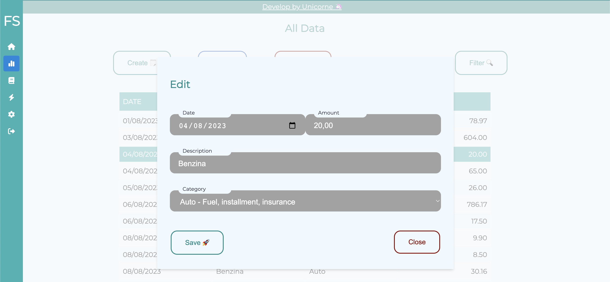

# Financial Stats 📊

[](https://github.com/teschiopol/financialStats/actions/workflows/test.yml)
[](https://www.codefactor.io/repository/github/teschiopol/financialstats)
[![CC BY-NC-SA 4.0][cc-by-nc-sa-shield]][cc-by-nc-sa]

[cc-by-nc-sa]: http://creativecommons.org/licenses/by-nc-sa/4.0/

[cc-by-nc-sa-shield]: https://img.shields.io/badge/License-CC%20BY--NC--SA%204.0-lightgrey.svg

A local app to manage your personal finance based on relevance.

## Docker 🐳

Create image

```
docker build -t YOUR_DOCKER_ID/PROJECT_NAME . -f Run.Dockerfile   
```

Run container

```
docker run -p 8080:80 YOUR_DOCKER_ID/PROJECT_NAME
```

## Local 📝

```
npm install
```

### Compiles and hot-reloads for development 👨🏻‍💻

```
npm run serve
```

### Compiles and minifies for production 🚀

```
npm run build
```

### Run tests ✅

```
npm test
```

## Pocketbase 🗂

You need to install [Pocketbase](https://pocketbase.io/) and then eventually change the path in package.json.

The template is in src/assets/.

Don't forget to set the parameters in the env file.

### Screenshot 🖥



Compare every day with months to have a perception of your monthly expenses routine.



Total of all categories.



Relevance subdivision.



Categories sample.



Edit operation on data list.
